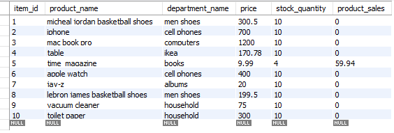
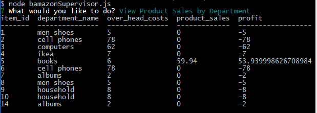

# NodeSql

Is a command line replica online store management system.

## Getting started

* Make sure you are in the working directory
* do a `npm i` from your command prompt

### Bamazon Costumer

run `node bamazonCustomer.js`  i have screenshots that will guide you threw expected results. See Below.

here is the database before we get started with our aplication.

Here are the results when you run `node bamazonCustomer.js`

Here are the results if you enter a quantity over what is in stock

### Bamazon Manager

run `node bamazonManager.js`  i have screenshots that will guide you threw expected results. See Below.

### Bamazon upervisor

run `node bamazonSupervisor.js`  i have screenshots that will guide you threw expected results. See Below.

Here is were we use two tables and do an inner join

